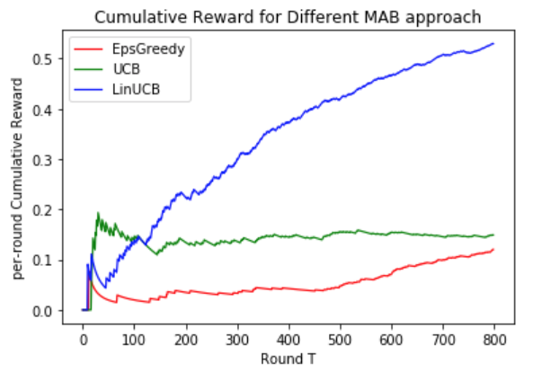

# Multi-armed-bandits
Applying MABs to Yahoo! News, in deciding what news items to recommend to users based on article content, user profile, and the historical engagement of the user with articles.

Given decision making in this setting is sequential—what do we show next—and feedback is only available for articles shown, Yahoo! researchers observed a perfect formulation for MABs like those (ε-Greedy and UCB) learned about in class. Going further, however, they realised that incorporating some element of user-article state requires contextual bandits: articles are arms; context per round incorpo- rates information about both user and article (arm); and {0, 1}-valued rewards represent clicks. Therefore the per round cumulative reward represents click-through-rate (CTR) which is exactly what services like Yahoo! News want to maximise to drive user engagement and advertising revenue. 

Run off-policy Evaluation(implement the algorithm first described as Algorithm 3 “Policy Evaluator” from the paper:
Lihong Li, Wei Chu, John Langford, Robert E. Schapire, ‘A Contextual-Bandit Approach to Per- sonalized News Article Recommendation’, in Proceedings of the Nineteenth International Conference on World Wide Web (WWW 2010), Raleigh, NC, USA, 2010. https://arxiv.org/pdf/1003.0146.pdf)

on each of my Python classes: ε-Greedy, UCB and LinUCB learners with hyperparameters. 

### The result:

